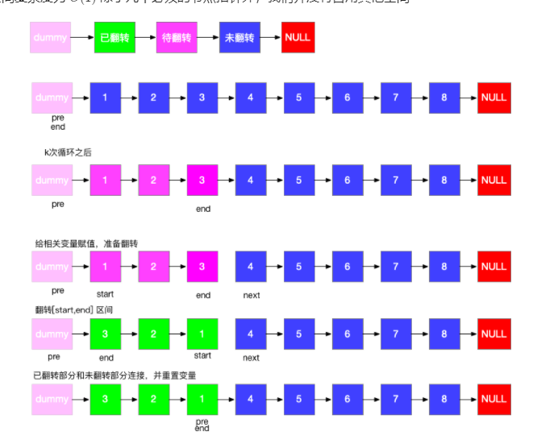

## 经典题目

### LC53-最大子序和

### 合并两个有序数组

### 买卖股票的最佳时机

### 验证回文串

### 二叉树的层序遍历

### 复制带随机指针的链表

### LRU缓存机制

### 岛屿数量

### 接雨水

### 最小覆盖子串

## 数组

### 寻找两个正序数组的中位数

### 盛最多水的容器

### 三数之和

### 下一个排列

### 搜索旋转排序数组

### 在排序数组中查找元素的第一个和最后一个位置

### 螺旋矩阵

### 合并区间

### 除自身以外数组的乘积

### 最后一块石头的重量Ⅱ

## 字符串

### 整数转换英文表示

### 字符串相加

### 验证回文字符串Ⅱ

### 最常见的单词

### 重新排列日志文件

## 链表

### LC02-两数相加

解题思路

* 将两个链表位置对齐进行相加
* 注意进位数
* 若最后一位的进位数大于0 则需生成一个新的节点

```java
public class Solution {

    public ListNode addTwoSum(ListNode l1, ListNode l2) {
        ListNode head = null, tail = null;

        int carry = 0;

        while (l1 != null || l2 != null) {
            int n1 = l1 != null ? l1.val : 0;
            int n2 = l2 != null ? l2.val : 0;

            int sum = n1 + n2 + carry;

            if (head == null) {
                head = tail = new ListNode(sum % 10);
            } else {
                tail.next = new ListNode(sum % 10);
                tail = tail.next;
            }

            carry = carry / 10;

            if (l1 != null) {
                l1 = l1.next;
            }

            if (l2 != null) {
                l2 = l2.next;
            }
        }

        if (carry > 0) {
            tail.next = new ListNode(carry);
        }

        return head;
    }

}


```

### LC03-无重复字符的最长子串（滑动窗口）

解题思路

__滑动窗口__

* 将符合条件的字符串作为一个窗口，遍历走完整个字符串;
* 初始化 `int left =0 ` 作为左侧的下标；
* 初始化 `int max = 0 ` 作为窗口的最大长度；
* 当符合遇到重复的字符时，窗口变化，形成新的窗口,此时 left -1，移出队列；

```java
public class Solution {
    public int lengthOfLongestSubstring(String s) {
        Map<Character, Integer> compareMap = new HashMap<>();

        int left = 0;
        int max = 0;

        for (int i = 0; i < s.length(); i++) {

            if (compareMap.containsKey(s.charAt(i))) {
                left = Math.max(left, s.charAt(i) + 1);
            }

            map.put(s.charAt(i), i);

            max = Math.max(max, i - left + 1);
        }

        return max;
    }
}
```

### 删除链表的倒数第N个节点

### 合并两个有序链表

### LC206-反转链表

详解见：

[面试题24-反转链表] [Sword24]

[Sword24]: ../剑指offer/剑指offer刷题.md:101

```java
public class Solution {

    public ListNode reverseList(ListNode node) {
        ListNode pre = null;
        ListNode cur = node;

        while (cur != null) {
            ListNode temp = cur.next;

            cur.next = pre;
            pre = cur;
            cur = temp;
        }
        return pre;
    }
}

```

### LC25-K个一组翻转链表

解题思路

* 根据图片找到各个节点的含义
* 重点关注当赋值给end后，要将 end断开 ` end.next = null`



```java

public class Solution {

    /**
     * 翻转K个一组的链表
     * @param head
     * @param k
     * @return
     */
    public ListNode reverseKGroup(ListNode head, int k) {
        ListNode dummy = new ListNode(0);

        if (head == null) {
            return null;
        }

        dummy.next = head;

        ListNode pre = dummy, end = dummy;

        while (head != null) {
            for (int i = 0; i < k && end != null; i++) {
                end = end.next;
            }

            // 若最后一组不满足k则直接返回
            if (end == null) {
                break;
            }

            // 给start next赋值 准备翻转
            ListNode start = pre.next;
            ListNode next = end.next;

            // 断开链表
            end.next = null;

            pre.next = reverse(start);
            // 翻转后头节点变到最后，通过.next把断开的链表重新连接起来
            start.next = next;

            pre = start;

            end = pre;
        }

        return dummy.next;
    }

    /**
     * 反转链表
     * @param node
     * @return
     */
    public ListNode reverse(ListNode node) {
        ListNode pre = null, cur = node;

        while (cur != null) {
            ListNode temp = cur.next;
            cur.next = pre;
            pre = cur;
            cur = temp;
        }

        return pre;
    }
}
```

## 堆与栈

### 有效的括号

### 会议室Ⅱ

### 前K个高频单词

### 移除无效的括号

## 哈希表

### LC01-两数之和

解题思路

*
	1. 双递归进行匹配，时间复杂度较高O(n²);
*
	2. 利用HashMap进行存储已有的数字进行匹配，时间复杂度为O(n)

```java
public class L1TwoSum {

    /**
     * 两数之和
     *
     * @param nums
     * @param target
     * @return
     */
    public int[] twoSum(int[] nums, int target) {

        if (nums.length == 0) {
            return new int[]{0, 0};
        }

        Map<Integer, Integer> map = new HashMap<>();

        for (int i = 0; i < nums.length; i++) {

            if (map.containsKey(target - nums[i])) {

                return new int[]{map.get(target - nums[i]), i};
            }

            map.put(nums[i], i);

        }

        return null;

    }
}


```

### 字母异位词分组

### 和为K的子数组

### 验证外星语词典

## 树

### 验证二叉搜索数

### 二叉树中的最大路径和

### 二叉树的右视图

### 二叉树的最近公共祖先

### 二叉树的直径

### 另一个树的子树

## 分治算法

### 合并K个排序链表

### Lc215-数组中的第K个最大元素

__解题思路__:

* 本题目的是考察排序，将无序的数组排序后输出第K个元素；

* 关于快速排序，网上有很多的方法，关于快速排序原理可查看 [快速排序原理图解][quicksort]
* Java版的参考 [快速排序的实现][java-quicksort]

[quicksort]: https://wiki.jikexueyuan.com/project/easy-learn-algorithm/fast-sort.html

[java-quicksort]: https://www.anvilliu.com/2021/03/08/%E5%BF%AB%E9%80%9F%E6%8E%92%E5%BA%8F%E7%9A%84Java%E5%AE%9E%E7%8E%B0%E5%92%8C%E4%BC%98%E5%8C%96/#%E4%B8%89%E5%90%91%E5%88%87%E5%88%86

```java
public class Solution {

    /**
     * 入口函数
     * @param nums
     * @param k
     * @return
     */
    public int findKthLargest(int[] nums, int k) {
        quickSort(nums, 0, nums.length - 1);

        return nums[nums.length - k];
    }

    public void quickSort(int[] nums, int left, int right) {
        if (left > right) {
            return;
        }

        // 三分法必须要先生成随机数 将left 与k的位置对调
        int k = (int) (Math.random() * (right - left + 1)) + left;

        swap(nums, left, k);

        int pivot = nums[left];

        int low = left;

        int high = right;


        while (low < high) {

            while (low < high && nums[high] >= pivot) {
                high--;
            }

            while (low < high && nums[low] <= pivot) {
                low++;
            }

            swap(nums, low, high);
        }

        swap(nums, left, high);

        quickSort(nums, left, low - 1);

        quickSort(nums, low + 1, right);

    }

    public void swap(int[] nums, int i, int k) {
        int temp = nums[i];
        nums[i] = nums[k];
        nums[k] = temp;
    }

}

```

### 搜索二维矩阵Ⅱ

### 最接近原点的K个点

## 回溯算法

### 电话号码的字母组合

### 括号生成

### 全排列

### 单词搜索

## 图论

### 单词接龙

### 火星词典

### 删除无效的括号

### 腐烂的橘子

### 查找集群内的 [关键连接]

## 动态规划

### 最长回文子串

### 最小路径和

### 编辑距离

### 单词拆分

### 零钱兑换

## 数学

### 整数反转

### 字符串转换整数(atoi)

### 二进制求和

### 快乐数

## 设计

### 数据流的中位数

### 二叉树的序列化和反序列化

### 常数时间插入、删除和获取随机元素