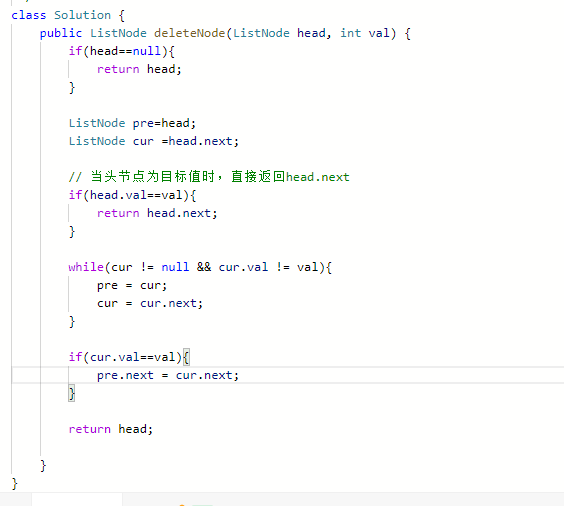

# 数据结构类题目

## LinkedList

### 面试题06-从尾到头打印链表 0520

### 面试题22-链表中倒数第k个结点 0520

### 面试题24-反转链表 0524 0628
> 1. 双指针进行头尾节点的指向；
> 2. 初始化`pre=null`;
> 3. 保存head为cur `ListNode cur =head`;
> 4. 当cur不为空时进行指针的指向反转;
> 5. 保存下一个节点的值`tmp = cur.next`;
> 6. 下一节点指向pre cur.next =pre;
> 7. pre指针前移一位 `pre=cur`;
> 8. 当前指针 cur指向之前保存的下一节点 `cur =tmp`;
> 9. 最终返回pre开始的链表;
```java
/**
 * 双指针反转
 */
public ListNode reverseListNode(ListNode head){
    ListNode pre = null,cur = head;
    
    while(cur!=null){
        ListNode temp = cur.next;
        cur.next = pre;
        pre = cur;
        cur = tmp;
    }
    
    return pre;
}

```

### 面试题25-合并两个排序的链表

### 面试题35-复杂链表的复制

> (略复杂放弃)

### 面试题52-两个链表的第一个公共节点

### 面试题18-删除链表的节点

> 1.双指针方法;当首节点为目标节点时直接返回head.next;<br>
2.否则循环判断cur,若cur！=null,pre=cur;cur=cur.next;<br>
3.当cur=val时，直接跳过cur,pre.next=cur.next;这样即可删除cur节点
> 

## Tree

### 面试题07-重建二叉树

> 1. 复制前序遍历数组，通过map保存中序遍历的各个节点的下标；
> 2. 初始遍历节点`recur(0,0,inorder.length-1)`
> 3. 创建树节点Node，根节点从前序遍历下标寻找 `new TreeNode(preorder[pre_root])`;
> 4. 获取当前根节点在前序的下标 `int idx=map.get(preorder[pre_root])`;
> 5. 当前树的左子树为 `root.left = recur(pre_root+1,left,idx-1)`;
> 6. 当前树的右子树为`root.right =recur(pre_root+(idx-left)+1,idx+1,right)`;
> 7. __注意点：__
>  * <font color=red>要判断迭代内部 `in_left > in_right` ;
>  * 构造treeNode时的初始化: `TreeNode treeNode =new TreeNode()`</font>;
```java
// 存放中序遍历各个节点的索引map
Map<Integer, Integer> map=new HashMap<>();

// 存放前序遍历的全局变量
int[]preorder;

/**
 * 构建二叉树的主结构
 */
public TreeNode buildTree(int[]preorder,int[]inorder){
   this.preorder=preorder;
   if(preorder==null||inorder==null){
       return null;
   }
   // 遍历存储中序遍历的数组
   for(int i=0;i<inorder.length;i++){
        map.put(inorder[i],i);
   }
   return recur(0,0,inorder.length-1);
}

/**
 * 根据当前的根节点索引位置 构建左右子树
 */
public TreeNode recur(int pre_root,int in_left,int in_right){
    // 当左节点大于右节点时则返回  这边容易出错
    if(in_left > in_right){
        return null;    
    }    
    TreeNode treeNode =new TreeNode(preorder[pre_root]);
    
    int idx=map.get(preorder[pre_root]);
    
    root.left = recur(preroot+1,in_left,idx-1);
    // 这一步的根节点是当前的下标减去左子树的下标+1
    root.right =recur(preroot+(idx-left)+1,idx+1,in_right);
    
    return treeNode;
}
```

### 面试题26-树的子结构

> 1. 递归遍历;
> 2. 输入TreeNode A 与B进行比较；
> 3. 首先A B两颗树不能为空;
> * __recur(A,B)函数：__
> 1. 当B为空时返回true（优先判断）
> 2. 判断是否子树的条件是:` A.val==B.val&&recur(A.left,B.left)&&recur(A.right,B.right)`
> 3. 在此条件下对A进行遍历，B的值是固定的；
> * __isSubStructure(A,B)函数：__
> 1. 判断树B是A树的子节点因此要判断 `isSubStructure(A.left,B)||isSubStructure(A.right,B)`
> 2. 同时还需要判断B树不为A的根节点的情况`recur(A,B)`
```java

/**
 * 判断是否时子结构的函数
 */
public boolean isSubStructure(TreeNode A,TreeNode B){
    if(A==null || B==null){
        return false;     
    }
    
    return recur(A,B)||isSubStructure(A.left,B)||isSubStructure(A.right,B);
}

public boolean recur(TreeNode A,TreeNode B ){
    if(B == null){
        return true;    
    }
    if(A == null){
        return false;
    }
    
    return A.val==B.val&&recur(A.left,B.left)&&recur(A.right,B.right);
}

```

### 面试题27-二叉树的镜像(反转二叉树)

> 1. 递归遍历；
> 2. 复制当前子树的左子树，保存下来；
> 3. 交换左右子树<br>
     `root.left=root.right`<br>
     `root.right=temp`
> 4. 在做反转二叉树时方法如下：<br>

```java
/**
 * 方法1
 */
public TreeNode invertTree(TreeNode root){
     if(root==null){
        return null;
     }
     TreeNode tempNode=root.left;
     root.left=root.right;
     root.right=tempNode;
     
     invertTree(root.left);
     invertTree(root.right);
     
     return root;
}

/**
 * 方法二
 */
public TreeNode mirrorTree(TreeNode root){
     if(root==null){
       return null;
     }
     TreeNode temp=root.left;
     
     root.left=mirrorTree(root.right);
     root.right=mirrorTree(temp);
     return root;
}
```

### 面试题32-1 -从上往下打印二叉树
> 1. BFS广度优先搜索；
> 2. 创建队列Queue来存储各个节点；
> 3. 当queue不为空时 poll当前节点，将节点值塞到数组`arraylist`中；
> 4. 当左右节点不为空时将左右节点放到 `queue` 中
> 5. 遍历打印 arraylist 中存放的值
> 6. <font color=red>注意点：<br>
>    * 初始化 `Quene<TreeNode> queue =new LinkedList<>(){{add(root);}};`
>    * 队列出列方法`queue.poll` 
     </font>
```java
public int[] printTree(TreeNode root){
    if(root==null){
        return new int[0];
    }
    // 初始化队列 内部类中将root赋值
    Queue<TreeNode> queue =new LinkedList<>(){{add(root)}};
    // 创建存放队列弹出的节点
    ArrayList<Integer> arrayList =new ArrayList(){};

   // BFS循环
   while (!queue.isEmpty()) {
        // 队首元素出列
        TreeNode node = queue.poll();
        // 将node.val添加至打印的数组中
        arrayList.add(node.val);

        // 添加左右子节点
        if (node.left != null) {
            queue.add(node.left);
        }

        if (node.right != null) {
            queue.add(node.right);
        }
   }
    
    int[] result =new int[arrayList.size()];
   
    for(in i=0;i<arrayList.size();i++){
        result[i] =arrayList.get(i);
    }     
    
    return result;
}
```

### 面试题32-2 -从上往下打印二叉树 2
> 1. 与32题相同的思路；
> 2. 不同点在打印时的分层操作：`for(int i=queue.size();i>0;i--)` 
> 3. <font color=red> for循环的第一个条件只会运行一次，queue的长度是在变化的</font>
```java
/**
 * 从上到下按层打印二叉树，同一层的节点按从左到右的顺序打印，每一层打印到一行。
 * 给定二叉树: [3,9,20,null,null,15,7],
 * 输出[[3],[9,20],[15,7]]
 */
public List<List<Integer>> levelOrder(TreeNode root) {
        List<List<Integer>> resultList =new ArrayList<>();

        if(root==null){
            return resultList;
        }

        Queue<TreeNode> queue =new LinkedList<TreeNode>(){{add(root);}};

        while(!queue.isEmpty()){

             List<Integer> array=new ArrayList<>();
             
             // for循环的第一个条件只会在初始化时运行一次
             for(int i=queue.size();i>0;i--){
                 TreeNode node =queue.poll();
     
                 array.add(node.val);
     
                 if(node.left!=null){
                     queue.add(node.left);
                 }
     
                 if(node.right!=null){
                     queue.add(node.right);
                 }
             }
        
            resultList.add(array);
        }
        return resultList;
}
```
### 面试题32-3 -从上往下打印二叉树 3

> 1. 与前两题类似，这次条件是之字型的打印；
> 2. 思路是在第二题的基础上进行标识符的判断；
> 3. 这里用到了`LinkedList`队首和队尾的机制,先进后出，`addLast`放在队尾，`addFirst`放在队首；
> 4. 判断每层的标识符用取余来计算奇偶，`resultList%2==0`
```java
public List<List<Integer>> levelOrder(TreeNode root) {
        List<List<Integer>> resultList = new ArrayList<>();

        if (root == null) {
            return resultList;
        }

        Queue<TreeNode> queue = new LinkedList<TreeNode>() {{
            add(root);
        }};

        while (!queue.isEmpty()) {
            LinkedList<Integer> temp = new LinkedList<>();

             for (int i = queue.size(); i > 0; i--) {
                  TreeNode node = queue.poll();
          
                  if (resultList.size() % 2 == 0) {
                    temp.addLast(node.val);
                  } else {
                    temp.addFirst(node.val);
                  }
                  if (node.left != null) {
                    queue.add(node.left);
                  }
          
                  if (node.right != null) {
                    queue.add(node.right);
                  }
            }
            resultList.add(temp);
        }
        return resultList;
}
```
### 面试题33-二叉搜索树的后序遍历序列(20210814 ac率较低，多回顾下)
> 1. 本题采用栈的方式进行遍历方式；
> 2. 外层for循环从高到低进行循环，把传入的数组压栈；
> 3. 因为时后续遍历，初始化root节点值为正无穷`int root =Integer.MAX_VALUE`
```java
for(int i=preorder.length-1;i>=0;i--){
    
    stack.add(preorder.[i]);
}
```
> 4. 判断是否为子树时当`preorder[i]>root` 返回false，
> 5. 迭代遍历栈进行判断
```java
public boolean verifyPostorder(int[] postorder){
    Stack<Integer> stack = new Stack<>();
    int root = Integer.MAX_VALUE;
    
    for(int i = postorder.length-1; i>=0; i--){
        if(postorder[i] > root){
            return false;
        }     
        
        while(!stack.isEmpty() && stack.peek() > postorder[i]){
            root=stack.pop();
        }
        stack.add(postorder[i]);
    }
    
    return true;
}
```

### 面试题34-二叉树中和为某一值的路径（回溯部分略生硬）
> 1. 本问题是典型的二叉树方案搜索，使用<font color=red><strong>*回溯法解决*</strong></font>;
> 2. 主要分为 *先序遍历* 和*路径记录* 两部分；
```java
     LinkedList<List<Integer>> resultList =new LinkedList<>();
     LinkedList<Integer> path = new LinkedList<>();

     public List<List<Integer>> pathSum(TreeNode root,int target){
            
         recur(root,target);
         
         return resultList;
     }
     
     public void recur(TreeNode root,target){
         
        if(root==null){
            return;
        }    
        
        path.add(root.val);
        
        target -=root.val;
        
        // 当target值为0 且左右节点为空时表示该路径为符合条件的最深路径
        if(target == 0 && root.left == null && root.right == null){
            resultList.add(new LinkedList(path));
        }
        
        recur(root.left,target);
        
        recur(root.right,target);
        
        path.removeLast();
     }
```
### 面试题36-二叉搜索树与双向链表
> 1. 考察dfs中序遍历；(具体应该是二叉树的中序遍历，二叉树的中序和后序都可以看作是DFS，因为他们在找到叶子节点前一直遍历)
> 2. 注意判断主函数的root是否为空，以及dfs迭代体中当前的节点是否为空;
> 3. 中序遍历实现:
```java
public void dfs(Node root){
    // 左
    dfs(root.left);
    // 中
    print(root.val);
    // 右
    dfs(root.right);
}
```
> 4. 基于中序遍历构建双向链表；
> 5. 构建链表时，若`pre==null` 表示无左子树,代表正在访问链表的头节点，`head=cur`；
> 6. 当`pre!=null`时，表示不在边界的节点上，此时修改链表的双向引用；
```java
pre.right = cur;
cur.left = pre;
```
> 7. 保存当前cur节点的值，更新pre=cur,往前移位；
> 8. 当dfs遍历完成后修改头尾指针`head.left = pre` pre指向尾节点；`pre.right = head` head指向头节点；
```java
Node pre,head;
public Node treeToDoublyList(Node root){
   if(root = =null){
       return null;
   }   
   
   dfs(root);
   
   head.left = pre;
   pre.right = head;
   
   return head;
}

public void dfs(Node cur){
   if(cur == null){
       return;
   }
   
   dfs(cur.left);
   
   if (pre == null){
       head =cur;
   } else {
       pre.right = cur; 
   }
   
   cur.left = pre;
   
   pre = cur;
   
   dfs(cur.right);
   
}
```

### 面试题55-1-二叉树的深度
> 1. 遍历二叉树，AC采用两种解法DFS和BFS；
> 
```java
/**
 * DFS遍历
 */
public int maxDepth(TreeNode root){
    if(root == null){
        return 0;    
    }
    
    int maxLeft =maxDepth(root.left);
    
    int maxRight = maxDepth(root.right);
    
    return Math.max(maxLeft,maxRight) + 1;
}

/**
 * BFS遍历
 */
public int maxDepth(TreeNode root){
    if(root == null){
      return 0;    
    }
    
    Queue<Integer> queue =new LinkedList<>(){{add(root);}};
    
    int depth=0;
    
    while(!queue.isEmpty()){
        depth++;
        int n =queue.size();
        for(int i=0;i<n;i++){
            TreeNode node = queue.poll();
            
            if(node.left != null){
                queue.add(node.left);    
            }   
            if(node.right != null){
                queue.add(node.right);    
            }
        }
    }
    return depth;
}
```


### 面试题55-2-平衡二叉树

### 面试题28-对称的二叉树

### 面试题37-序列化二叉树

### 面试题54-二叉搜索树的第k大节点

## Stack & Queue

面试题09-用两个栈实现队列

面试题30-包含min函数的栈

面试题31-栈的压入、弹出序列

面试题58-1-翻转单词顺序

面试题59-1-滑动窗口的最大值

## Heap

面试题40-最小的K个数

## Hash Table

面试题50-第一个只出现一次的字符

## 图

面试题12-矩阵中的路径(BFS)

面试题13-机器人的运动范围(DFS)

## 具体算法类题目

### 斐波那契数列

面试题10-1-斐波拉契数列

面试题10-2-青蛙跳台阶问题

### 搜索算法

面试题04-二维数组中的查找

面试题11-旋转数组的最小数字（二分查找）

面试题56-1-数组中数字出现的次数（二分查找）

### 全排列

面试题38-字符串的排列

### 动态规划

面试题42-连续子数组的最大和

面试题19-正则表达式匹配(我用的暴力)

### 回溯

面试题12-矩阵中的路径(BFS)

面试题13-机器人的运动范围(DFS)

### 排序

面试题51-数组中的逆序对(归并排序)

面试题40-最小的K个数(堆排序)

### 位运算

面试题15-二进制中1的个数

面试题16-数值的整数次方

### 其他算法

面试题05-替换空格

面试题21-调整数组顺序使奇数位于偶数前面

面试题39-数组中出现次数超过一半的数字

面试题43- 1～n整数中1出现的次数

面试题45-把数组排成最小的数

面试题49-丑数

面试题57-2-和为S的连续正数序列(滑动窗口思想)

面试题57-和为S的两个数字(双指针思想)

面试题58-2-左旋转字符串(矩阵翻转)

面试题62-圆圈中最后剩下的数(约瑟夫环)

面试题66-构建乘积数组
